  <a href="README.md"><strong>English</strong></a>
  &nbsp;·&nbsp;
  <a href="README.zh-CN.md">简体中文</a>
  &nbsp;·&nbsp;
  <a href="README.vietnam-vn.md">Tiếng Việt</a>

  
  
  
  

  
  
  

---

## About Me

<table>
<tr>
<td width="58%" valign="top">

I am a final-year student, researcher, and developer working in **Artificial Intelligence**, **Data Science**, and **Computer Vision**.

My current interests include:

- Generative AI and diffusion models
- Generative adversarial networks
- Object detection and visual recognition
- Applied machine learning systems
- Research-driven AI applications

I enjoy transforming research ideas into practical systems, improving model performance, and exploring modern approaches in artificial intelligence.

</td>
<td width="42%" align="center">

</td>
</tr>
</table>

---

## Research Focus

<table>
<tr>
<td align="center" width="25%">
<strong>Generative AI</strong> 
Intelligent content generation and foundation models
</td>
<td align="center" width="25%">
<strong>Diffusion Models</strong> 
Image synthesis and generative modeling
</td>
<td align="center" width="25%">
<strong>Computer Vision</strong> 
Visual understanding and image analysis
</td>
<td align="center" width="25%">
<strong>Object Detection</strong> 
Detection, localization, and recognition
</td>
</tr>
</table>

---

## Technology Stack

### Development

  

### AI, Machine Learning and Computer Vision

 

  

### Cloud, Storage and Databases

---

## GitHub Activity

<!--
These SVG cards are generated by .github/workflows/update-readme-stats.yml.
With the GH_STATS_TOKEN secret configured, private repository statistics are included.
-->

  

 

Statistics cards are generated securely through GitHub Actions. Private repository names and details remain hidden.

---

## Connect, Research and Professional Profiles

<table>
<tr>
<td width="50%" align="center" valign="top">

Projects, research interests, experience and selected work.

</td>
<td width="50%" align="center" valign="top">

Publications, citations and academic research profile.

</td>
</tr>

<tr>
<td width="50%" align="center" valign="top">

Persistent researcher identity and academic record.

</td>
<td width="50%" align="center" valign="top">

Professional background, experience and connections.

</td>
</tr>

<tr>
<td width="50%" align="center" valign="top">

Machine learning notebooks, datasets and competitions.

</td>
<td width="50%" align="center" valign="top">

Updates, interests and social activity in Chinese.

</td>
</tr>

<tr>
<td colspan="2" align="center" valign="top">

Culture, lifestyle and personal interests.

</td>
</tr>
</table>

---

